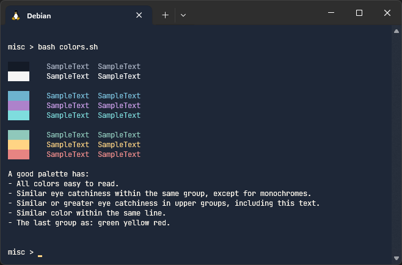
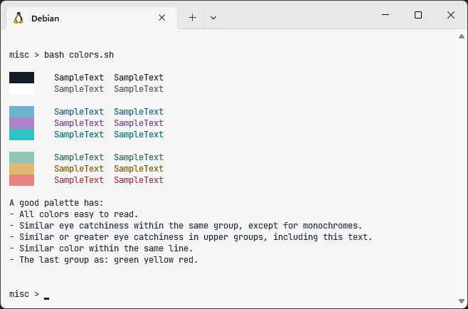

# Windows Terminal Night Shift & Day shift themes

A port of my vscode themes ([Night Shift](https://github.com/Jean-Tinland/vscode-theme-desaturated) and [Day Shift](https://github.com/Jean-Tinland/vscode-theme-day-shift)) for Windows Terminal.\
You'll find a Google Chrome theme [here](https://github.com/Jean-Tinland/chrome-theme-desaturated), an iTerm2 theme [here](https://github.com/Jean-Tinland/iTerm2-theme-desaturated) and a Warp theme [here](https://github.com/Jean-Tinland/warp-theme-night-shift).

## Preview

### Night Shift

### Day Shift

Displayed colors output: [colors](https://gitlab.com/es20490446e/colors).\
Used font: [JetBrains Mono](https://www.jetbrains.com/lp/mono/).

## Installation

Open Windows Terminal settings (`ctrl`+`,`), then click on the bottom left button to open settings as JSON. You can paste the content of the theme you want in the `schemes` array.
